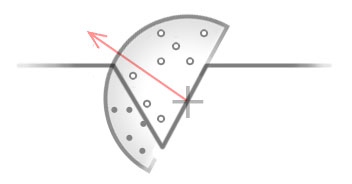

<!--.slide: data-background="./asset/img/taxi.jpg" -->


# ECharts GL - 在数据可视化中探索高品质的渲染

Note:

---


Note:
开始之前我们先来看一长很经典的描述这二十年游戏画面的进步的图，就是古墓丽影里劳拉这个角色的演变。
大家如果玩游戏的话应该有看过这张图片

----


Note:
早起的古墓丽影因为机器性能的限制，只能用非常少的多边形，光影效果也很简单，甚至是没有光影，只有简陋的贴图。

----

<!--.slide: data-background="asset/img/rise-of-the-tomb-raider.jpg" -->

Note:
更真实会带来更强的临场感和沉浸感

----


Note:
图形学渲染领域在过去十几年有了翻天覆地的变化，我们可以在像游戏这样对实时渲染重度依赖的场景里应用 PBR，阴影，SSAO，景深，屏幕空间反射等渲染技术。

----


----

<!--.slide: data-background="./asset/img/city-graphic-high.jpg" -->

---

## 丰富的渲染效果

+ 光影

+ 材质

+ 后期

Note:
仅仅能够画出来是不够的，我们还需要通过各种效果把图片渲染好看

很多时候我们不喜欢三维的可视化，一方面是因为它并没有二维的那么清晰，还有一个很重要的原因是很多三维的渲染效果很糟糕，比如用着过时的光照模型。充满锯齿的画面。但是如果我们提升一下渲染的品质，把一张图渲染好看了，我相信很少会有人不喜欢。


光影是场景有立体感的主要来源。有真实感的材质能够让我们看到一个图形后立马联想到这是什么东西，后期可以模拟一些摄像机或者 ps 的效果让画面更有质感。

---

## 光影

+ 日光和阴影

+ 环境光和阴影

+ 自发光

Note:
ECharts GL 中的场景主要有两种光源，日光和环境光。这些是图形或者三维场景中的物体接受到的光照，除此之外，一些需要突出的物体可能还会有自发光。

----

## 日光


Note:

日光作为大部分场景的主要光源，可以有效的给整个场景区分整体的明暗面。

----

<iframe class="fullscreen" frameborder="0" data-src="asset/ec-demo2/globe-sun.html"></iframe>

Note:
现在是凌晨 4 点北京的上空

----

## 阴影


Note:
日光被遮挡的地方会产生阴影。

在图中这样建筑可视化的示例中，阴影是用来增强空间感的一个非常重要的手段，如果没有阴影，我们可能会觉得这些区域就是一片连起来的，建筑也是浮在地面上的感觉。

----

<iframe class="fullscreen" frameborder="0" data-src="asset/ec-demo2/geo3D-shadow.html"></iframe>

Note:
这是一个三维的地图动态阴影的效果。前段时间设计圈特别流行制作长阴影，差不多就是这样的一个效果

----

## 环境光

+ Image Based Lightning


Note:
基于图片的环境光作为补充，提供了各个方向的光源，可以让场景的光照不那么单一，在一些背光面也能获取到一些光照信息而不是完全黑色的。

----


----

## 环境光的阴影

+ Screen Space Ambient Occulusion



Note:
计算环境光的阴影是一件开销非常大的事，所以实时的渲染一般都用非常取巧的屏幕空间的环境光遮蔽。

就是像这种图中那样在图形表面的半球内采样，估计一个点上面能够受到多少环境光，被其它物体包围得越多的地方就会越暗。一般实时的渲染里为了性能只会采样十几次到几十次，所以噪点会非常多，还需要一层额外的双边滤波去减少噪点。

它作为阴影的补充可以让整个画面更有层次感，不会让阴影显得很单调。


----


<iframe class="fullscreen" frameborder="0" data-src="asset/ec-demo2/buildings-ssao.html"></iframe>

Note:
可以看下有环境光遮蔽和没有的区别。

环境光遮蔽可以让这些挨得比较近的建筑因为光照不够显得比较暗。

----

## 自发光

Note:

除了外来的光源。有些物体它本身也会发光，而不会因为阴影的缘故无法被看到。比如各种霓虹灯，这些因为自发光而高亮的点非常容易吸引人的注意力

----

<iframe class="fullscreen" frameborder="0" data-src="asset/ec-demo2/globe-night.html"></iframe>

Note:
比如我们拿这张夜晚的图片放到地球上，它里面的星星点点的灯光就属于灯光的自发光。它们不会受太阳暗面的影响，反而因为其它地方都暗下来了，更容易突出哪些地方比较繁华，大些地方夜生活比价少，哪些地方几乎没有人烟。

---

## 材质

+ 真实感

+ 风格化

Note:
渲染的第二块是材质

渲染里的材质有两个极端，一种是追求真实，要真实感，还有一种是风格化，就是按某种特定的风格去渲染，比如模拟卡通效果，电子效果，素描效果等等。不管是真实感还是风格化，材质的存在都是为了能够让人增加对图形的感知，看到这个东西后一下就产生代入感和沉浸感。

----

## 真实感

----

## Physically Based Rendering

+ HDR 的环境光照贴图

+ 对环境光照的积分预计算（prefilter）

+ 能量守恒的光照公式

+ <s>经验模型</s> 直观的公式参数。


Note:

GL 的真实感渲染主要是基于 PBR 的材质。大家如果玩游戏的话可能有听过这个词。

一般基于物理的渲染有这么几点，首先刚才提到过的它需要一张环境光照贴图。这个贴图格式是 HDR 的，刚才提到过更大范围的颜色可以表达更丰富的光照强度。

然后因为光照计算需要做积分计算这张环境贴图里每一个像素产生光照贡献，如果是实时做的话就会性能很差，所以一般会对这张环境光照的贴图做积分的预计算。得到右边这张看起来像是被模糊了的图。这种预计算的卷积可能不是完全正确的结果，但是足够以假乱真了。实际上实时渲染基本上就是在用各种 trick 去实现以假乱真的效果。

Ok，然后最后我们再使用一个能量守恒的光照公式应用到像素上。


// 实时渲染肯定很难做到离线渲染的品质和逼真程度，但是我们希望通过一些 trick 让画面达到以假乱真的品质

----

## 金属和光泽度

+ metalness

    + 0 非金属

    + 1 金属

+ roughness

    + 0 完全光滑

    + 1 完全粗糙

Note:

金属度和光泽度是刚才提到的公式中非常重要的两个参数，这两个参数是 normalize 后的，比如金属度 metalness，0 就是非金属，1就是金属，0 - 1 之间的值实际上是两者之间的插值，用得比较少。roughness 的话 0 就是全光滑

----

<iframe class="fullscreen" frameborder="0" data-src="asset/ec-demo2/globe-material.html"></iframe>

Note:
金属和非金属有个区别是因为菲尼尔反射的参数不一样，上面的塑料材质的边缘视角和平面角度小反射比较强，中间正对着的反射比较弱，金属的是不管什么角度反射都差不多。

----

## 风格化

Note:
风格化则是渲染的另外一个极端

----

## Cross Hatching

Note:
Cross Hatching 在有些场景下有奇效

----


<iframe class="fullscreen" frameborder="0" data-src="asset/ec-demo2/surface-hatching.html"></iframe>

Note:

不知道下面有没有学习绘画的朋友，想到自己练习速写的日子。

----

<iframe class="fullscreen" frameborder="0" data-src="asset/ec-demo2/buildings-hatching.html"></iframe>


---

## 摄影与后期

Note:

渲染的第二块加一些摄影中常见的镜头效果以及后期处理

----

## 景深


----

<iframe class="fullscreen" frameborder="0" data-src="asset/ec-demo2/bar3D-dof.html"></iframe>

Note:
景深可以让整个场景有一种微缩模型的感觉

----

<iframe class="fullscreen" frameborder="0" data-src="asset/ec-demo2/globe-dof.html"></iframe>

Note:
景深焦散所带来的光斑也让整个画面更有德味

----

## 调色 Color Grading


Note:
当然跟摄影一样，你可能会对图片出来的整个色调不满意，所以一般再会有一个颜色纠正的操作，

TODO
其它更多数字艺术的作品, Glitch, Dot Screen

---

## 渐进增强

+ 将采样分布到多帧中

+ 交互的时候能够立刻反馈

+ 停止交互后渐进增强画面

Note:
前面提到的效果，比如环境光遮蔽，都是需要大量的采样才能达到比较好的效果，还有比如锯齿本质上也是因为屏幕像素有限时对几何边缘采样不足导致的。

----


Note:
左边是没有渐进式增强而且效果配置比较低的，右边是同样的配置但是渐进式增强后的画面，可以看到画面质量提升了很多，包括像这些高频部分更加平滑，还有线条的质量，阴影的质量，都有了很大的改善。

---

## 案例

---

## 程序生成的场景

+ 数据 + 规则 + 参数

Note:
程序生成，
数据 -> 程序规则 -> 场景

这是数据可视化比较有魅力的地方，你改改参数和规则就可能同样一份数据出来不一样的效果。甚至你的规则或者参数写错了，你会发现这张出来的效果图更有意思哎。

但是这种程序生成的场景也有缺点，就是没办法做一些耗时比较长的预计算和处理已得到更好的渲染效果了，这就需要我们后面在渲染部分花更大的功夫。

然后我们其实也在考虑把这些程序生成的场景能够导出到通用的三维模型交换格式，比如 collada，以供用户导入到三维工具中进行二次编辑和更好离线渲染。


我们在接下来通过几个例子看看，一些常见的二维数据在三维场景中是什么效果


----

## 像素

Note:
首先来看一个图片的像素数据的例子。


----

<iframe class="fullscreen" frameborder="0" data-src="asset/ec-demo2/bar3D-image-pixels.html"></iframe>

Note:

图片的像素数据呢它是二维的，每一个像素有 x, y, r, g, b, a 的属性。

我们可以把每个像素画成一个柱子。柱子的颜色就是像素的颜色。然后切换到三维视角。

然后把每个像素计算出来的亮度映射到柱子的高度，然后再加上后期效果，就可以得到这个非常奇幻有点像是丛林和火山的形状

----

## 音频

<iframe data-src="asset/ec-demo2/audio-waveform.html" width="800" height="150" frameborder="0"></iframe>

Note:

这是一个最基础的把音频的波形可视化出来的效果，横轴是时间

----

<iframe class="fullscreen" frameborder="0" data-src="asset/ec-demo2/bar3D-music.html"></iframe>

Note:

我们可以使用 WebAudio 的 API 把时域的波形图转成频域。

同时通过镜头动画辅助表达整个音乐的节奏，可以让用户更容易被这 Motion 带入节奏。

----

## 地图


Note:
ECharts 中的地图使用的是存储行政区域或者国家轮廓的 GeoJSON 数据。我们用 Canvas 把这些轮廓画出来，在不同的国家或者行政区域填充不同的颜色。

这个是我们设计师用 echarts 制作的一张旅行城市的地图。

----

+ GeoJSON

    + Polygon

+ Triangulation


Note:
我们需要做的就是把通过三角化的算法把多边形转成更适合 WebGL 绘制的三角面。

----


<iframe class="fullscreen" frameborder="0" data-src="asset/ec-demo2/map3D.html"></iframe>


Note:
TODO MAPBOX 例子

----

## 函数

<iframe data-src="asset/ec-demo2/polar.html" width="400" height="300" frameborder="0"></iframe>

Note:
如果要可视化的是一个函数或者方程的话，连输入的数据都可以是根据函数的规则程序生成了

----

## 参数曲面

```javascript
u: { min: -PI, max: PI, step: PI / 20 },
v: { min: 0, max: PI, step: PI / 20 },

x: (u, v) => sin(v) * sin(u),
y: (u, v) => sin(v) * cos(u),
z: (u, v) => cos(v)

```

Note:
例如参数曲面

参数曲面是三维空间中表达参数方程的曲面图。

这段代码描述的一个球面

----

<iframe class="fullscreen" frameborder="0" data-src="asset/ec-demo2/surface-sphere.html"></iframe>

----

<iframe class="fullscreen" frameborder="0" data-src="asset/ec-demo2/surface-parametric.html"></iframe>

Note:
如果参数方程复杂点我们还看到更有意思的曲面，比如这个像零件一样的曲面一直是我最喜欢的一个参数曲面，因为那它来试验各种渲染算法效果非常好。

----

#### Metalness Map


#### Roughness Map


Note:
为了描述更复杂的材质，我们可以把描述材质的属性存到各个纹理上。这样就可以精确到像素的去描述每个像素的材质了。

----

<iframe class="fullscreen" frameborder="0" data-src="asset/ec-demo2/surface-complex-material.html"></iframe>

Note:
比如这么一个生锈的零件

---

## 开普敦的出租车线路

----


----

<iframe class="fullscreen" frameborder="0" data-src="asset/ec-demo2/mapbox-taxi.html"></iframe>


---

<!--.slide: data-background="./asset/img/london-city.jpg" -->

# Thanks


---
